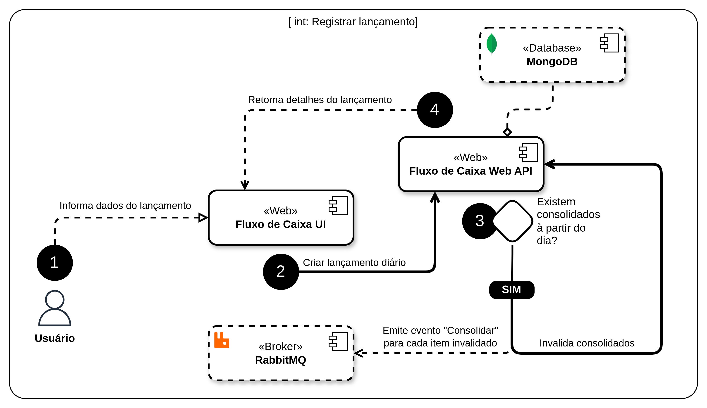

# Serviço de fluxo de caixa diário

Um comerciante precisa controlar o seu fluxo de caixa diário com os lançamentos
(débitos e créditos), também precisa de um relatório que disponibilize o saldo
diário consolidado.

## Requisitos de negócio

- Serviço que faça o controle de lançamentos
- Serviço do consolidado diário

## Solução

Será construída uma solução para *Fluxo de Caixa* que contenha:

- Um aplicativo web para que o usuário possa visualizar e manter seu fluxo de
  caixa através de lançamentos de débito e crédito, além de poder solicitar e
  visualizar relatórios de consolidação de saldo diário.

- Todo registro será feito por uma API Web que garantirá consistência de regras
  de negócio do lado do servidor e manterá os dados em um banco não relacional.

- O cálculo dos dados para o relatório consolidado será feito por um serviço
  executando em segundo e de forma independente da API Web. A comunicação
  entre esses componentes será feita através de um mecanismo assíncrono de
  mensagens.

- Tanto o aplicativo Web quanto a API Web estarão protegidos por um serviço de
  identidade centralizado que usa o protocolo de autenticação/autorização
  [OpenID Connect][OPENID_CONNECT].

> Caso o serviço de consolidado pare de funcionar, a aplicação web continuará
> funcionando, porém sem a possibilidade de geração de relatórios consolidados
> de saldo diário.

Abaixo temos uma ideia geral dos componentes da solução e a interação entre eles:

## Detalhes da solução

Serão construídos os seguintes casos de uso:

### Autenticar usuário

O usuário não se autenticará diretamente na aplicação web, ao invés disso a
mesma irá redirecionar o usuário para se autenticar no serviço de identidade
[Keycloak][KEYCLOAK], que cuidará de toda a parte de segurança para autenticar
corretamente o usuário, e ao final redirecioná-lo já autenticado para a
aplicação.

### Registrar lançamento

O usuário autenticado poderá registrar um lançamento informando seus dados:

- Data e hora do lançamento
- Descrição do lançamento
- Tipo: _Crédito_ ou _Débito_
- Valor do lançamento

Esses serão registrados por uma Web API para garantir a integridade da
informação, considerando:

- O registro deve estar sempre vinculado ao usuário dono. E um usuário não pode
  enxergar os dados de outros usuários.

- Não deve ser permitido o registro de mais de um lançamento com mesmo tipo,
  descrição, data e hora

- Caso haja uma cosolidação já registrada para o dia do lançamento, essa
  deve ser invalidada, e uma mensagem para o serviço **Consolidado** deve ser
  emitida para que o cálculo seja refeito.

### Visualizar lançamentos

O usuário autenticado poderá visualizar os lançamentos que já fez. Esses serão
servidos pela API de forma paginada para evitar sobrecarga aos serviços, além
de serem ordenados por data/hora.

### Calcular consolidação diária

O usuário autenticado poderá solicitar a visualização do consolidado diário em
um dia específico. Não iremos fazer o cálculo do saldo consolidado em tempo de
consulta por questões de _performance_. Ao invés disso, o usuário deve informar
o dia que deseja ver o saldo consolidado, e uma entrada será criada para indicar
isso, porém o saldo permanecerá pendente até que seja calculado de fato por um
serviço em execução em segundo plano.

O serviço saberá o que calcular através de mensagens recebidas da Web API
através de fila em um [_broker de mensagens_][MESSAGE_BROKER].

### Visualizar consolidação diária

O usuário autenticado poderá visualizar o saldo consolidado diário que já foi
calculado anteriormente. Para isso precisará selecionar um dia que já tenha
solicitado o cálculo, e então visualizar os dados consolidados. Caso acesse um
dia cujo os dados ainda não tenham sido calculados, ele será informado dessa
situação para que aguarde e tente visualizar novamente mais tarde.

> O dado pode não estar disponível caso nunca tenha sido calculado anteriormente,
> ou caso o serviço de consolidação esteja indisponível, ou ainda se o dado já
> tenha sido calculado, mas por uma modificação nos registros daquele dia o
> saldo tenha sido invalidado, o que o coloca na fila para recalculo
> automaticamente.

### Diagrama de infraestrutura na AWS

Usaremos os recursos das núvens públicas para complementar os requisitos de
segurança, escalabilidade e redudância que precisamos.

No diagrama abaixo temos um exemplo de como se daria a implantação em na nuvem
da [AWS][AWS], mas o mesmo se daria em outras nuvens como [GCP][GCP] ou [OCI][OCI].

No diagrama podemos ver principalmente como aplicamos as restrições de segurança
quanto ao tráfego de entrada permitido. Combinamosm um _Web Application Firewall_
e o _CloudFront_ para garantir a proteção contra ataques e a segurança do
tráfego criptografado com _SSL/HTTPS_.

Um _Load Balancer_ se comunica com o _Container Service_ em conjunto com grupos
de _auto scalling_ para entregar as demandas requisitadas, e escalar
horizontalmente nossos _containers_ com base na necessidade.

Nossas aplicações reais estão protegidas em redes privadas, e o tráfego ao mundo
externo é controlado através de configurações de NAT.

Aqui nós substituímos nossos containers de bancos relacionais (Keycloak DB) pelo
serviço gerenciado compatível, e o mesmo ocorre para filas do _RabbitMQ_, e
nossas bases não relacionais do _MongoDB_.

Vale ressaltar que optamos pelo serviço de _cluster gerenciado_ do próprio
_MongoDB_ chamado [_MongoDB Atlas_][MONGODB_ATLAS] porque é totalmente compatível
com as núvens públicas mencionadas, e a segurança é garantida através de
emparelhamento seguro de _VPC_.

## Anotações gerais

- Não implementamos um mecanismo de registro de usuários devido ao tempo
  disponível para implementação da solução, portanto está fora do escopo.
  Mas em uma situação real ou a aplicação permitiria o *auto-registro* de
  usuários, ou um outro serviço faria essa gestão (*back office* por exemplo).
  Por hora faremos o registro de usuários diretamente no console do
  [Keycloak][KEYCLOAK].
- A implementação atual não entrega artefatos nem guias para implantação em
  ambiente de produção devido ao tempo disponível para concepção da solução.
  Mas uma ideia de como seria a infraestrutura de produção é apresentada para
  que se tenha a visão de que alguns requisitos da aplicação são atendidos
  através de outros componentes que não estão presentes em código de aplicativo.
  Tais como WAF para proteção contra ataques, balanceamento de carga e múltiplas
  regiões de implantação para alta disponibilidade.
- Usamos um banco [MongoDB][MONGODB] compartilhado entre a Web API e o _worker_ Consolidado
  por questões de prazo, mas em uma situação ideal cada um usaria sua base e
  fariamos a sincronização também através de mensagens com serviços _side car_.
- Por questões de prazo não otimizamos a _interface do usuário_ para experiência.
  O aguardar a geração do relatório pode exigir atualização explícita de tela, o
  que não é recomendado em um caso real. Nessas situações usaríamos o protocolo
  [_Web Socket_][WEBSOCKET] para atualizar a _interface do usuário_ em tempo
  real, de acordo com o relatório seja gerado.

<!-- links -->
[OPENID_CONNECT]: https://openid.net/developers/how-connect-works
[KEYCLOAK]: https://www.keycloak.org
[MONGODB]: https://www.mongodb.com
[WEBSOCKET]: https://developer.mozilla.org/pt-BR/docs/Web/API/WebSockets_API
[MESSAGE_BROKER]: https://en.wikipedia.org/wiki/Message_broker
[AWS]:
  <https://aws.amazon.com/pt>
  "Amazon Web Services"
[GCP]:
  <https://cloud.google.com>
  "Google Cloud Platform"
[OCI]:
  <https://www.oracle.com/br/cloud/compute>
  "Oracle Cloud Infrastructure"
[WAF]: https://pt.wikipedia.org/wiki/Web_Application_Firewall
[MONGODB_ATLAS]: https://www.mongodb.com/atlas