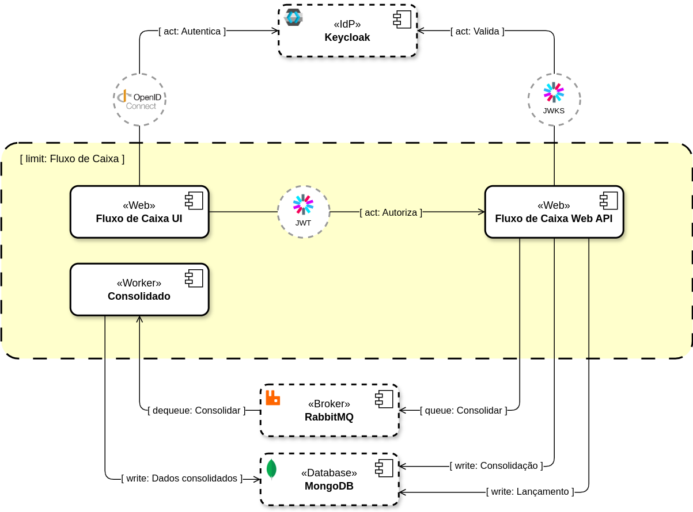
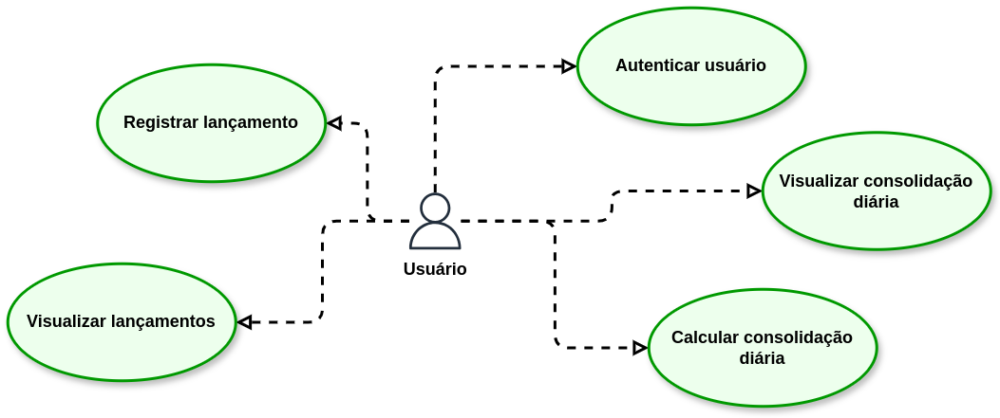

# Serviço de fluxo de caixa diário

Um comerciante precisa controlar o seu fluxo de caixa diário com os lançamentos
(débitos e créditos), também precisa de um relatório que disponibilize o saldo
diário consolidado

## Requisitos de negócio

- Serviço que faça o controle de lançamentos
- Serviço do consolidado diário

## Solução

Será construída uma solução para *Fluxo de Caixa* que contenha:

- Um aplicativo web para que o usuário possa visualizar e manter seu fluxo de
  caixa através de lançamentos de débito e crédito, além de poder solicitar e
  visualizar relatórios de consolidação de saldo diário.

- Todo registro será feito por uma API Web que garantirá consistência de regras
  de negócio do lado do servidor e manterá os dados em um banco não relacional.

- O cálculo dos dados para o relatório consolidado será feito por um serviço
  executando em segundo e de forma independente da API Web. A comunicação
  entre esses componentes será feita através de um mecanismo assíncrono de
  mensagens.

- Tanto o aplicativo Web quanto a API Web estarão protegidos por um serviço de
  identidade centralizado que usa o protocolo de autenticação/autorização
  [OpenID Connect][OPENID_CONNECT].

> Caso o serviço de cálculo de dados para os relatórios pare de funcionar, a
> aplicação web continuará funcionando, porém sem a possibilidade de geração de
> relatórios consolidados de saldo diário.

Abaixo temos uma ideia geral dos componentes da solução e a interação entre eles:

## Detalhes da solução

Serão construídos os seguintes casos de uso:

### Autenticar usuário

O usuário não se autenticará diretamente na aplicação web, ao invés disso a
mesma irá redirecionar o usuário para se autenticar no serviço de identidade
[Keycloak][KEYCLOAK], que cuidará de toda a parte de segurança para autenticar
corretamente o usuário, e ao final redirecioná-lo já autenticado para a
aplicação.

### Registrar lançamento

### Visualizar lançamentos

### calcular consolidação diária

### Visualizar consolidação diária

### Diagrama de infraestrutura em produção

> TODO

## Anotações gerais

> Conheça as decisões arquiteturais em [decisoes.md](decisoes.md).

- Não implementamos um mecanismo de registro de usuários devido ao tempo
disponível para implementação da solução, portanto está fora do escopo. Mas
em uma situação real ou a aplicação permitiria o *auto-registro* de usuários,
ou um outro serviço faria essa gestão (*back office* por exemplo).
- A implementação atual não entrega artefatos nem guias para implantação em
ambiente de produção devido ao tempo disponível para concepção da solução. Mas
uma ideia de como seria a infraestrutura de produção é apresentada para que
se tenha a visão de que alguns requisitos da aplicação são atendidos através
de outros componentes que não estão presentes em código de aplicativo. Tais
como WAF para proteção contra ataques, balanceamento de carga e múltiplas
regiões de implantação para alta disponibilidade.

[OPENID_CONNECT]: https://openid.net/developers/how-connect-works
[KEYCLOAK]: https://www.keycloak.org
[MONGODB]: https://www.mongodb.com
[RABBITMQ]: https://www.rabbitmq.com
[MESSAGE_BROKER]: https://en.wikipedia.org/wiki/Message_broker